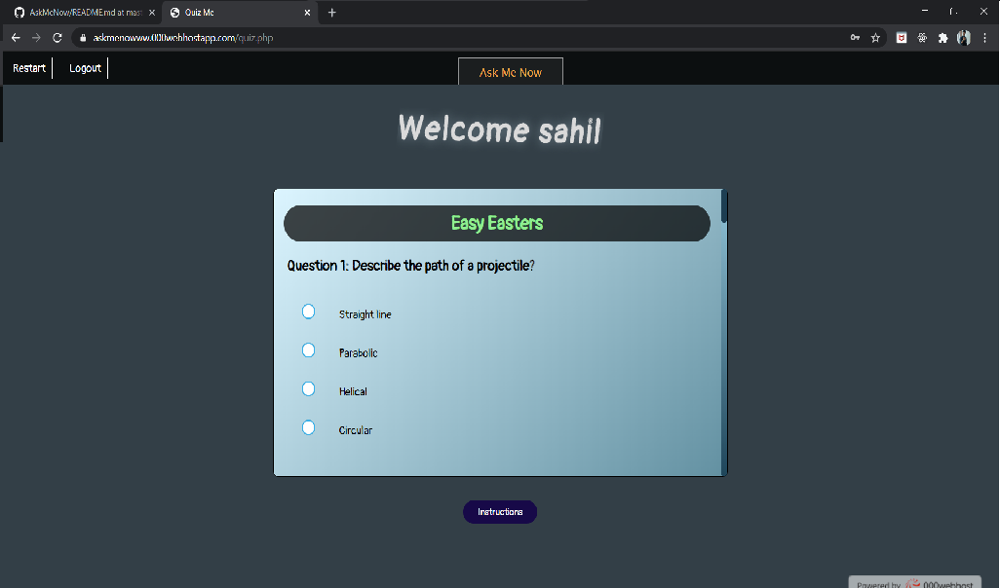

# AskMeNow
'AskMeNow' is a quizzing website where you can create an account and login to play a quizzing game. [Visit](http://askmenowww.000webhostapp.com/)

## Here is a guide and description to get you started:
- You can create your account or login if already have an account. In case, you forget password, there is provision to change it.
- Once logged in, you will continue from the last stage you logged out from. You can restart your progress anytime you want to start afresh
- The quiz is divided into 4 sections:
  - Easy
  - Normal
  - Hard
  - Extreme
- Each proceeding level will be harder than preceeding one. Questions mainly revolve around Programming in Python, PHP, CSS etc, networking and some funny miscellaneous. 
- The order of questions will be shuffled each time you refresh the page and you may also see some new questions that were not in previous set.
- After the submission, you will see a table showing all the responses and correct answers along with passing threshold and a link to leaderboard.
- Leaderboard is a paginated view of all the users showing 10 users per page. 

## Upcoming plans for project:
- A profile section would be added where user can add bio, profile picture etc.
- A friend request feature to connect with other users.
- A chat box to send real time messages.
- A challenge section where user can have rapid fire quiz rounds with each other.

